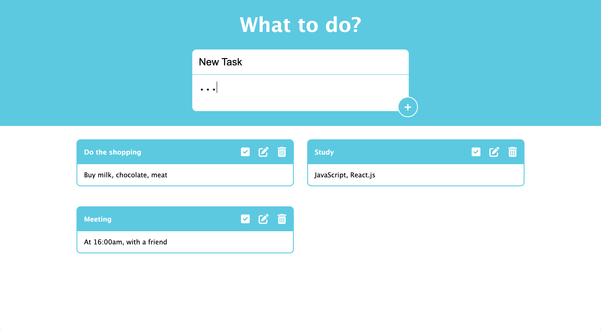

# To-Do-App

## Overview

### The challenge

Users should be able to:

- View the optimal layout for the component depending on their device's screen size
- See hover states for all interactive elements on the page
- Add new tasks to the list
- Select done or undone tasks by clicking check mark
- Edit and delete task via related buttons

### Screenshot

### Links

- Live Site URL: [https://yusuf-demirci.github.io/To-Do-App/](https://yusuf-demirci.github.io/To-Do-App/)

### Built with

- Semantic HTML5 markup
- CSS custom properties
- Flexbox & Grid
- Mobile-first workflow
- JavaScript & JQuery

